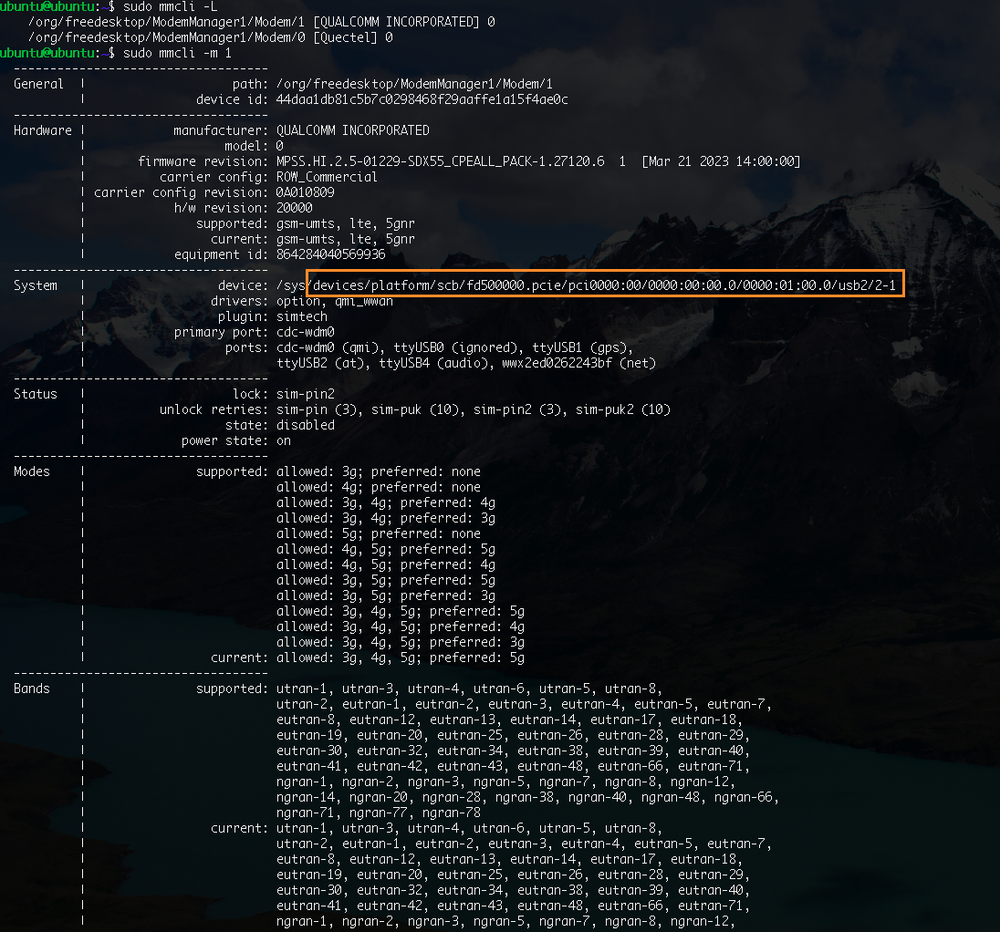

# Setting user provided Modem UID

---

### Get device location

- Get the location where the device is running. Can be determined with `mmcli -m`:



- Copy the path under System > device. Note that the URL begins with `/device/…`

### Create/modify Modem Manager rules

- Create/modify the Modem Manager naming rules:

```bash
sudo nano /lib/udev/rules.d/78-mm-naming.rules
```

- Define the device path and the desired UID-name: (for above example)

```bash
DEVPATH=="/devices/platform/scb/fd500000.pcie/pci0000:00/0000:00:00.0/0000:01:00.0/usb2/2-1",ENV{ID_MM_PHYSDEV_UID}="SIMCOM"
```

Here, SIMCOM is the desired name. The file should now look like this: 

```bash
ACTION!="add|change|move|bind", GOTO="mm_naming_rules_end"
DEVPATH=="/devices/platform/scb/fd500000.pcie/pci0000:00/0000:00:00.0/0000:01:00.0/usb1/1-1/1-1.4",ENV{ID_MM_PHYSDEV_UID}="TRM250"
DEVPATH=="/devices/platform/scb/fd500000.pcie/pci0000:00/0000:00:00.0/0000:01:00.0/usb2/2-1",ENV{ID_MM_PHYSDEV_UID}="SIMCOM"
LABEL="mm_naming_rules_end"
```

### Trigger rules and restart ModemManager

- In the last step, you should reload and trigger the new/modified rule and restart ModemManager:

```bash
sudo udevadm control --reload-rules
sudo udevadm trigger
sudo systemctl restart ModemManager

#optional: reboot system
```

- Now it should be possible to use the new UID to interact with mmcli:

```bash
sudo mmcli -m SIMCOM
```